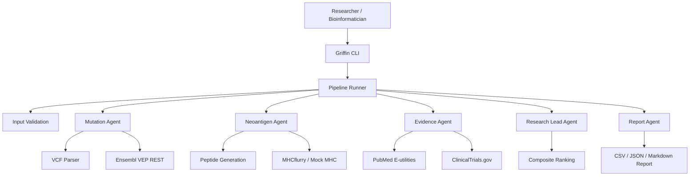
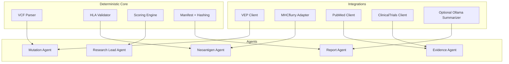

# Griffin CLI

Griffin is a command-line research engine for reproducible neoantigen candidate discovery. In plain terms: Griffin takes a variant file from tumor sequencing, the sample's HLA alleles, and cancer-type metadata, then builds a traceable research report that ranks possible neoantigen candidates for follow-up review.

Griffin is built for local, transparent, scientific workflows. It is not a clinical product.

> Research Use Only: Griffin is a computational research acceleration tool. It does not provide diagnosis, treatment recommendations, patient eligibility decisions, medical advice, clinically validated vaccine candidates, or therapeutic actionability. All outputs require independent wet-lab validation and expert review.

## What Griffin Does

Griffin helps researchers move from raw variant data to auditable candidate tables and reports.

It accepts:

- A VCF file containing variants.
- One or more HLA alleles, such as `HLA-A*02:01`.
- Cancer type metadata, such as `melanoma`.
- A sample ID.
- Genome assembly metadata, such as `GRCh37` or `GRCh38`.

It produces:

- Ranked candidate tables in CSV and JSON.
- Structured evidence artifacts.
- Run manifests and scientific provenance.
- Checkpoints for reproducibility and resume support.
- A Markdown report, with optional PDF support.

## Current Scientific MVP Status

Griffin currently supports a complete deterministic mock workflow for demos and testing. It also has real Ensembl VEP annotation and real MHCflurry Class I binding prediction integrated.

The first full non-mock scientific workflow is still in progress. The main missing piece is biologically traceable peptide generation from real protein sequence context.

| Area | Status | Notes |
|---|---|---|
| CLI workflow | Working | `init`, `doctor`, `validate-input`, `run`, `resume`, `report`, `version` |
| Mock end-to-end run | Working | Explicit `--mock` only |
| VCF parsing | Working | Small synthetic fixture included |
| HLA validation | Working | Syntax validation implemented |
| Ensembl VEP REST | Implemented | Real annotation client, cache, raw artifacts, transcript selection |
| MHCflurry | Implemented | Real Class I affinity prediction path verified |
| Reports | Working | Markdown report with Research Use Only language |
| Real peptide generation | In progress | Next major MVP milestone |
| Real PubMed retrieval | Not complete | Mock evidence remains visibly synthetic |
| Real ClinicalTrials.gov retrieval | Not complete | Mock trial records do not use fake NCT IDs |
| Critic Agent | Not started | Required before full Scientific MVP completion |
| Safety Agent | Not started | Required before full Scientific MVP completion |

## Architecture At A Glance



## Pipeline Flow

```mermaid
flowchart LR
    A[VCF + HLA + Cancer Type + Assembly] --> B[Validate Inputs]
    B --> C[Parse VCF]
    C --> D[Annotate Variants with VEP]
    D --> E[Generate Peptides]
    E --> F[Predict MHC Binding]
    F --> G[Gather Evidence]
    G --> H[Score and Rank]
    H --> I[Research Lead Review]
    I --> J[Export Artifacts]
    J --> K[Generate Report]
```



Today, mock mode completes the full flow. Non-mock mode has real VEP and MHCflurry available, but full candidate generation still depends on the upcoming traceable peptide-generation milestone.

## Agent Responsibilities



## Why Mock Mode Exists

Mock mode is for demos, tests, and development. It is deterministic, explicit, and visibly marked in outputs.

Mock mode does not produce scientific evidence. Griffin intentionally avoids silent fallback from real integrations to mock data.

Use mock mode when you want to verify the CLI and output structure:

```powershell
uv run python -m griffin run `
  --vcf data/examples/tiny.vcf `
  --hla HLA-A*02:01 `
  --cancer-type melanoma `
  --sample-id demo-001 `
  --out runs/demo-001 `
  --genome-assembly GRCh37 `
  --mock
```

## Installation

Griffin uses `uv` for the recommended development workflow.

```powershell
cd "D:\Griffin"
uv sync --python 3.11 --group dev
```

Griffin's scientific stack should use Python 3.11. Newer Python versions may run some mock/demo paths, but MHCflurry compatibility is best with Python 3.11.

## MHCflurry Setup

Install MHCflurry into the active Griffin environment:

```powershell
uv pip install --python .\.venv\Scripts\python.exe mhcflurry "numpy==1.26.4" "scipy==1.11.4" "scikit-learn==1.3.2" "pandas==2.1.4"
uv run mhcflurry-downloads fetch models_class1_pan
```

Check readiness:

```powershell
uv run python -m griffin doctor
```

A healthy scientific MHC setup should show:

```json
{
  "mhcflurry_available": true,
  "mhcflurry_downloads_available": true,
  "scientific_mhc_ready": true
}
```

## Quickstart

### 1. Check the environment

```powershell
uv run python -m griffin doctor
```

### 2. Validate input

```powershell
uv run python -m griffin validate-input `
  --vcf data/examples/tiny.vcf `
  --hla HLA-A*02:01 `
  --cancer-type melanoma
```

### 3. Run a mock demo

```powershell
uv run python -m griffin run `
  --vcf data/examples/tiny.vcf `
  --hla HLA-A*02:01 `
  --cancer-type melanoma `
  --sample-id demo-001 `
  --out runs/demo-001 `
  --genome-assembly GRCh37 `
  --mock
```

The included `tiny.vcf` is a synthetic GRCh37-style BRAF V600E fixture. Use `--genome-assembly GRCh37` for this example.

### 4. Open results

```powershell
explorer "D:\Griffin\runs\demo-001"
notepad "D:\Griffin\runs\demo-001\report.md"
notepad "D:\Griffin\runs\demo-001\candidates.csv"
```

## Output Structure

Each run writes a reproducible output folder:

```text
runs/<sample-id>/
  manifest.json
  run_manifest.json
  config.resolved.yaml
  report.md
  candidates.csv
  candidates.json
  evidence.json
  logs/
    griffin.log
  inputs/
    input.vcf
    input.sha256
  artifacts/
    variants.raw.json
    variants.annotated.json
    peptides.generated.json
    mhc_predictions.json
    candidates.scored.json
    evidence.json
    final_candidates.json
  outputs/
    candidates.csv
    candidates.json
    evidence.json
    report.md
  checkpoints/
    *.done
```

## Real VEP Annotation

Non-mock variant annotation uses Ensembl VEP REST. Griffin records raw responses, cache keys, selected transcripts, and considered transcripts.

Transcript selection is deterministic:

1. MANE Select transcript.
2. Canonical protein-coding transcript.
3. Protein-coding transcript with a valid protein consequence.
4. Stable deterministic fallback.

Unsupported or malformed responses fail clearly. Griffin does not substitute mock annotations in non-mock mode.

## Scoring Summary

Candidates are scored using transparent component scores, including binding, presentation, mutation impact, and evidence. Weak binders are capped so literature evidence alone cannot make a poor binding candidate look strong.

The scoring system is intended for computational research prioritization only. It is not a clinical validation score.

## Commands

```powershell
uv run python -m griffin init
uv run python -m griffin doctor
uv run python -m griffin validate-input --vcf data/examples/tiny.vcf --hla HLA-A*02:01 --cancer-type melanoma
uv run python -m griffin run --vcf data/examples/tiny.vcf --hla HLA-A*02:01 --cancer-type melanoma --sample-id demo-001 --out runs/demo-001 --genome-assembly GRCh37 --mock
uv run python -m griffin resume --run-dir runs/demo-001
uv run python -m griffin report --run-dir runs/demo-001 --pdf
uv run python -m griffin version
```

## Tests And Quality

```powershell
uv run pytest -q
uv run ruff check .
uv run mypy griffin
```

Expected current result:

```text
25 passed, 1 warning
All checks passed!
Success: no issues found in 54 source files
```

## Configuration

Optional environment variables:

```powershell
$env:NCBI_EMAIL = "you@example.org"
$env:NCBI_API_KEY = ""
$env:GRIFFIN_CACHE_DIR = ".griffin/cache"
$env:GRIFFIN_LOG_LEVEL = "INFO"
```

Ollama is optional and currently only used for summarizing already retrieved structured evidence. It must not create evidence identifiers, titles, claims, genes, variants, or clinical conclusions.

## Development Roadmap To Scientific MVP

Completed:

- CLI scaffold and commands.
- Deterministic mock end-to-end run.
- VCF parsing and HLA validation.
- Run manifests, checkpoints, reports, and output artifacts.
- Scientific provenance fields.
- Safe mock evidence and trial records.
- Real MHCflurry prediction integration.
- `uv` development workflow.
- Real Ensembl VEP REST annotation client.
- D-drive environment verified with Python 3.11 and MHCflurry.

Remaining MVP milestones:

1. Traceable protein sequence retrieval.
2. Mutant and wild-type peptide generation from real sequence context.
3. Real non-mock candidate generation through MHCflurry.
4. First complete non-mock run without `--mock`.
5. Formal Intake Agent output.
6. Critic Agent for scientific quality review.
7. Safety Agent for Research Use Only enforcement.
8. Real PubMed retrieval.
9. Real ClinicalTrials.gov retrieval.
10. Transparent scoring artifacts with per-component contributions.
11. Benchmark suite.
12. Versioned recipe and skill manifests.

## Scientific Boundaries

Griffin must not say or imply that a candidate is clinically validated, safe, effective, recommended, actionable, or suitable for patient care. Griffin outputs computational research priorities only.

Researchers should independently review every artifact, validate candidates experimentally, and interpret results with qualified scientific and clinical experts.

## License

MIT. See `LICENSE`.
