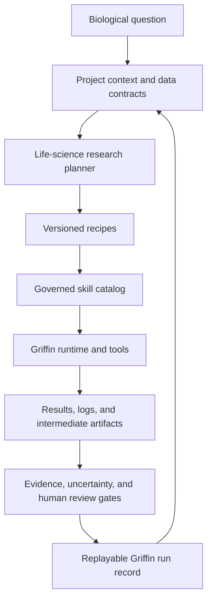

# Griffin Foundation Architecture

## Product Boundary

Griffin is a life-sciences research companion. It uses an agent to coordinate
validated computational work while preserving the information needed to inspect,
repeat, and critique that work.

Griffin supplies the workbench foundation: local server, browser UI, model
routing, sessions, tools, extension model, and basic skill discovery. Griffin
owns the life-sciences domain layer.

## Domain Layer

Each project carries its research objective, organism, assay and modality,
reference assets, sample relationships, consent/data-handling constraints, and
accepted assumptions. Skills and recipes receive only the context required for
their task.

Compatible `SKILL.md` sources are normalized into Griffin catalog entries. An
entry records its source, revision, license, life-science domain, input/output
contracts, tool permissions, validation level, and clinical-risk classification.

Catalog tiers are `experimental`, `reviewed`, and `validated`. Only reviewed and
validated skills are selectable by a reproducible recipe. Clinically adjacent
workflows require explicit human review and must never present an AI output as a
diagnosis or treatment recommendation.

A recipe is a versioned directed graph of skills with typed inputs, expected
outputs, deterministic checkpoints, and approval gates. A run binds a recipe to
exact input hashes, reference assets, parameters, environment/tool/model
versions, artifacts, warnings, and reviewer decisions.

The agent can propose a recipe or request missing data. It cannot silently swap
scientific methods, invent a missing input, or present a simulated result as an
observed result.

## Source Strategy

| Source | Role in Griffin | License |
| --- | --- | --- |
| Griffin | Workbench and agent-runtime foundation | Apache-2.0 |
| AIPOCH Medical Research Skills | Evidence, protocol, analysis, and writing capabilities | MIT |
| ClawBio | Bioinformatics skills, local-first reproducibility, benchmark patterns | MIT |

Source revisions and required notices are retained in the project root. Imported
skills are catalog material until Griffin has normalized and reviewed them.

## Milestones

1. Rebrand and isolate the Griffin foundation.
2. Implement the Griffin catalog schema, importer, and validation gate.
3. Classify AIPOCH and ClawBio skills with provenance.
4. Build project context, data-contract checks, and research memory.
5. Implement the validated canine neoantigen recipe end to end.
6. Add workspace views for projects, recipes, runs, artifacts, evidence, and reviews.
