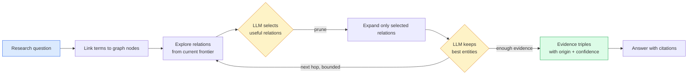
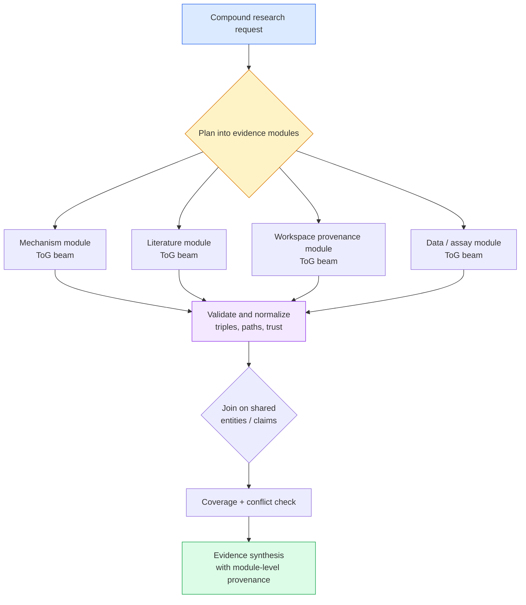
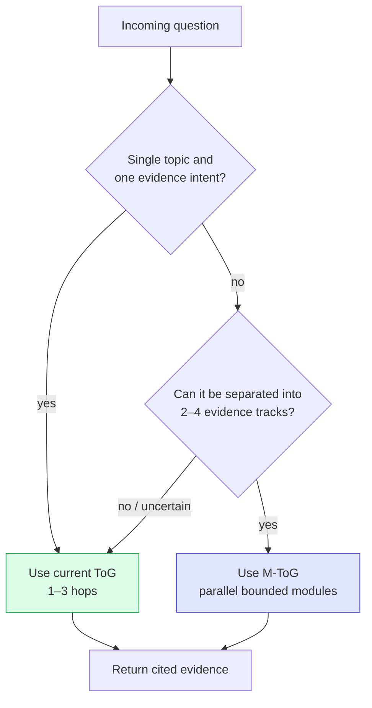

# 14 — Modular Think-on-Graph

## Decision in one sentence

Keep the existing **Think-on-Graph (ToG)** beam search as Griffin’s default for one focused, multi-hop question. Add **Modular Think-on-Graph (M-ToG)** as a planner above it when a research request naturally separates into independent evidence tracks (for example *mechanism + papers + prior runs + dataset provenance*). It is a composition of bounded ToG searches, **not** a replacement graph store or a second source of truth.

This document calls it *M-ToG* to distinguish the proposed orchestration pattern from the existing `graph_reason` tool.

---

## The two flows

### A. Existing Think-on-Graph: one question, one adaptive beam



The implementation already exists:

- `storage/db/graph/beam.ts` proposes linked entities, relations, candidates, and evidence.
- `storage/db/graph/reason.ts` owns the bounded traversal (`depth ≤ 5`, `width ≤ 16`) and prevents revisit loops.
- `tool/graph-reason.ts` exposes explicit primitives for a transparent agent-driven loop.
- `tool/graph-reason-tool.ts` exposes `graph_reason`, a one-call server orchestrator using a small-model pruner.

**Best fit:** “Which papers support the claim about the gene from last week’s run?” The question has one semantic center and each hop changes what the next useful relation is.

### B. Modular Think-on-Graph: plan, run focused beams, then synthesize



For the same request, a planner could produce this explicit plan:

| Module | Question | Seeds | Relations / scope | Output |
| --- | --- | --- | --- | --- |
| mechanism | “What pathway connects `TP53` to apoptosis?” | `TP53`, `apoptosis` | biological claims/entities | mechanistic path candidates |
| literature | “Which accepted sources support those path claims?” | `TP53` + path nodes | `derived-from`, source/claim | citable sources |
| provenance | “Which prior Griffin runs produced or consumed these artifacts?” | selected sources/artifacts | `mentions`, `produced`, `consumed`, `part-of` | reproducible workspace trail |
| data | “Which assays or cohorts constrain the claim?” | assay/cohort nodes | project-defined claim relations | applicability and gaps |

Each module retains the normal ToG sequence—link → relation prune → expand → entity prune → evidence—but has a narrower goal, trust policy, and budget. The coordinator joins **only returned, validated evidence**, never planner prose.

---

## Differences that matter in Griffin

| Dimension | Think-on-Graph | Modular Think-on-Graph |
| --- | --- | --- |
| Unit of reasoning | One adaptive beam | A DAG of small, named beams |
| Question shape | Focused, 2–3-hop retrieval | Compound questions with separable sub-questions |
| Graph access | One frontier and one hop budget | Per-module seeds, relation allowlists, and budgets |
| Cost / latency | Lowest; `graph_reason` uses two small-model calls per hop | Higher, but independent modules can run concurrently; cap total budget |
| Explainability | A single path/beam trace | Module trace plus explicit cross-module joins; clearer for complex answers |
| Failure mode | A broad question can make a beam choose a mediocre compromise path | A bad module can be isolated/retried; poor planning can omit a crucial track |
| Best outcome | Direct answer grounded in one connected neighborhood | Research brief combining mechanism, literature, experiment, and project history |
| Wrong use | Splitting a simple lookup adds orchestration tax | Running every request as modules wastes calls and may fragment one causal path |

### Advantages of standard ToG

1. **Cheaper and faster.** One frontier avoids duplicated linking, traversal, and synthesis.
2. **More adaptive.** A discovery at hop one can immediately change the relation chosen at hop two.
3. **Already shipped.** It uses current trusted graph primitives and is the safest default.
4. **Ideal for sparse graphs.** Griffin’s knowledge graph grows with observed searches and workspace events; a single beam makes the most of a small connected neighborhood.

### Advantages of M-ToG

1. **Better coverage for scientific questions with multiple evidence types.** It prevents provenance edges from competing with biology or literature edges in one generic beam.
2. **Independent budgets and policies.** A provenance module can permit `part-of`; a biological evidence module can forbid it. A literature module can require accepted sources while an exploratory module may include unreviewed claims labeled as such.
3. **Parallelizable latency.** Independent modules can execute with `Promise.all` while a global semaphore protects model and database capacity.
4. **More auditability.** The response can say which module established each conclusion, which module had no coverage, and where modules disagree.
5. **Incremental retries.** Rerun only the failed or insufficient module, not the full investigation.

---

## Recommendation for the application

Use a **hybrid router**, not a user-facing mode switch by default:



Start M-ToG only when the planner identifies at least two independently useful modules, each with concrete seed terms and a distinct evidence intent. Otherwise fall back to standard ToG. Do **not** use M-ToG for `graph_search`, `graph_neighbors`, or a question whose answer is expected from one relation.

For Griffin, the highest-value initial template is **research brief**:

- *What we know* — entity/claim mechanism module.
- *What supports it* — sources and confidence module.
- *What we did* — session/run/artifact provenance module.
- *What remains uncertain* — coverage and conflict module.

This matches the product’s life-sciences research-companion role while preserving the distinction already encoded in the graph: observed/system facts are different from agent assertions.

---

## Implementation design

### 1. Add a typed plan contract

Put the orchestration layer beside, rather than inside, the storage search engine: `backend/cli/src/tool/graph-modular-tool.ts`. `GraphReason.run` stays pure and reusable.

```ts
const ModuleSchema = z.object({
  id: z.string().regex(/^[a-z][a-z0-9-]{0,31}$/),
  goal: z.string().min(1).max(400),
  terms: z.array(z.string()).min(1).max(10),
  relations: z.array(z.string()).max(12).optional(),
  depth: z.number().int().min(1).max(3).default(2),
  width: z.number().int().min(1).max(8).default(4),
  includeUnreviewed: z.boolean().default(false),
  dependsOn: z.array(z.string()).max(3).default([]),
})

const PlanSchema = z.object({
  modules: z.array(ModuleSchema).min(2).max(4),
})
```

The planner may suggest a plan, but the server must validate it before execution:

- module IDs must be unique;
- dependencies must reference known modules and form a DAG;
- terms and relations must be bounded;
- relation names must be intersected with those actually offered by `Beam.exploreRelations` (the existing hallucination defense);
- enforce a whole-request budget, e.g. `sum(depth × width) ≤ 48` and no more than two concurrent modules;
- reject or collapse a plan with fewer than two valid modules to normal ToG.

### 2. Reuse the existing engine through scoped pruners

Each valid module invokes `GraphReason.run` with its own goal and seeds. The injected pruner should receive the module’s relation allowlist as an additional server-side filter; it should not be trusted to remember the plan. The current model-driven `ask` pattern in `graph-reason-tool.ts` can be factored into a small reusable pruner factory.

```ts
const permitted = offered.filter((relation) =>
  !mod.relations || mod.relations.includes(relation),
)
const chosen = (await pruner.relations({ question: mod.goal, hop, options }))
  .filter((relation) => permitted.includes(relation))
```

A module with no linked seed is an explicit **coverage gap**, not a reason to invent an answer or fail the complete request.

### 3. Execute dependency levels safely

Modules without dependencies run in parallel. A dependent module receives only normalized outputs from its predecessors—selected node IDs and evidence triples—not free-form model conclusions. This keeps the join grounded in the database.

```ts
const ready = modules.filter((mod) => mod.dependsOn.every((id) => done.has(id)))
const results = await Promise.all(ready.map((mod) => runModule(mod, evidence)))
```

Use the same read-only `DatabaseClient.reader()` behavior as current graph reasoning. Every write remains an explicit `kb_*` action; M-ToG must not auto-assert claims merely because multiple modules agree.

### 4. Normalize, join, and synthesize evidence

Persist or return a structured result shape:

```ts
{
  modules: [{ id, goal, seeds, hops, triples, stopped, coverage }],
  joins: [{ entityId, moduleIds, tripleIds }],
  conflicts: [{ subject, relation, values, moduleIds }],
  uncovered: [{ moduleId, reason }],
}
```

Join on canonical graph node IDs, accessions, and explicit edges—not labels. Preserve `origin`, `review_state`, and `confidence` through the join. The final writer receives this structure and must:

- cite system/observed and agent-asserted statements differently;
- describe a missing module as missing evidence, not negative evidence;
- surface contradictory values instead of voting them away;
- state module-level limitations.

### 5. Tool and UI behavior

Expose one expert tool, `graph_reason_modular`, with `question`, optional `terms`, and an optional `mode: "auto" | "research-brief"`. Keep `graph_reason` unchanged for compatibility. The UI can render a collapsible **Investigation map** with modules, hop counts, evidence count, and stopped reason; it should not expose raw chain-of-thought or planner deliberation.

Roll out behind `experimental.db=primary` plus a separate feature flag such as `experimental.graph_modular_reasoning`. Start with the fixed `research-brief` template; enable free-form planner decomposition only after evaluation.

---

## Guardrails and non-goals

- **No second graph or vector index.** M-ToG uses the existing SQLite knowledge graph and its trust filtering.
- **No autonomous knowledge writes.** Synthesis does not create `kb_assert` records.
- **No unbounded fan-out.** The global cap is enforced in code, not only in the tool schema.
- **No planner authority over provenance.** `produced`, `consumed`, and `part-of` remain observed-only relations.
- **No claim that parallel modules are independent facts.** They are retrieval strategies; agreement is not verification.
- **No need to expose a “modular” toggle to ordinary users.** Auto-routing and an understandable investigation summary are preferable.

---

## Evaluation and acceptance criteria

Build a fixture corpus with known cross-cutting answers: biology claim + PubMed source + prior run/artifact + an intentionally conflicting or unreviewed claim.

| Check | Acceptance criterion |
| --- | --- |
| Routing | Focused questions select ToG; compound research-brief questions select M-ToG; ambiguous cases fall back to ToG. |
| Coverage | On the cross-cutting fixture, M-ToG retrieves at least one correct evidence item from each required track and improves track coverage over one broad beam. |
| Grounding | Every final cited statement maps to a returned triple; no synthesis-only claim is represented as observed. |
| Safety | Invalid IDs/relations, cyclic module plans, missing seeds, and exhausted budgets cannot crash or expand scope. |
| Trust | Rejected nodes never appear; unreviewed assertions appear only where explicitly allowed and remain labeled. |
| Cost | Standard ToG remains the default. M-ToG stays within the global model-call and concurrency caps, and records per-module usage. |
| Auditability | Result includes module goal, seeds, visited nodes, stop reason, triples, joins, conflicts, and uncovered tracks. |

The initial implementation is successful when it makes a compound Griffin research answer **more complete and easier to audit** than the current single beam, without making simple graph questions slower or less reliable.
